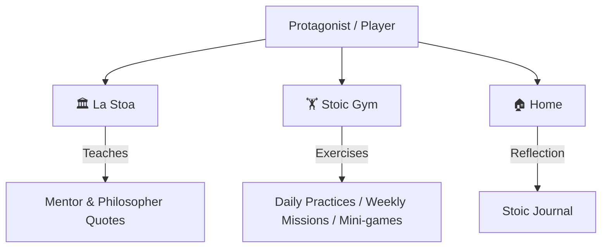

# Stoa: Un viaje interior

[](https://godotengine.org)
[](https://docs.google.com/document/d/e/2PACX-1vQUyZvZb9Db5rbEDn4J1nB0cQgKnZ87DQ9K2x1xgkl7ibmkJ9K2BRR8HduQIGSM8kIoDo2CFy2xmqzq/pub)
[](GDD.md)
[](#technical-overview)
[](#language-and-localization)

An immersive, gamified RPG companion built to guide users through the practical and deep understanding of Stoic Philosophy. Learn, practice, and reflect as you progress through an interactive journey toward mental clarity and inner serenity.

---

> [!IMPORTANT]
> ### Language and Localization
> **English**: While this documentation is written in English for developer accessibility, the game's actual client, text, narratives, and dialogues are localized entirely in **Spanish** (titled *Stoa: Un viaje interior*).
> 
> **Español**: La documentación principal está escrita en inglés, pero el cliente de juego, interfaz, textos, narrativa y diálogos están completamente localizados en **español**.

---

## 🏛️ Game Overview & Vision

*Stoa* is more than a mobile game; it is conceived as a **life companion**. Players step into the shoes of a young protagonist feeling overwhelmed by modern anxiety, distractions, and the constant search for external validation. Guided by a wise mentor, they embark on an inner journey to master their responses to life's external events.

For a comprehensive explanation of the game's philosophy, narrative arcs, and detailed architectural blueprints, consult the official **[Google Doc GDD](https://docs.google.com/document/d/1nLAktXKdIWnROiCxghWwAuX-49K0ZGJzblWr9kq6qmo/edit?usp=sharing)** or the local **[Game Design Document (GDD.md)](GDD.md)**.

---

## 🗺️ Key Locations & Gameplay Elements



### 🏛️ La Stoa (The Portico)
The central hub where players meet their wise mentor. Here, players receive core teachings, philosophical guidance, and daily inspiration to keep them grounded.
* **Philosopher Quotes**: The game features a rich database of sayings from Marcus Aurelius, Epictetus, and Seneca. These quotes are defined and easily expandable in [`Dungeons/quotes.json`](Dungeons/quotes.json).

### 🏋️ Stoic Gym (Gimnasio Estoico)
The training ground for the character and mind. In the Gym, players complete various exercises and challenges to earn Virtues and progress.
* **Daily Practices & Weekly Missions**: Interactive, practical challenges (such as Morning Meditations or *Premeditatio Malorum*) designed to bridge the game experience with real-world reflection. These missions are configured in [`Dungeons/gym_missions.json`](Dungeons/gym_missions.json).
* **Interactive Mini-games**: Interactive games that test specific Stoic concepts (such as the *Dichotomy of Control*). 

### 🏠 Home (Hogar)
A private, intimate space where players can consult and write in their **Stoic Journal** (*Diario Estoico*). The journal features guided prompts to assist with auto-observation and personal growth.

---

## 📈 Progression & Virtues System

Character growth in *Stoa* is not measured by traditional XP, but by consistent, balanced practice across the **Four Cardinal Virtues**:

| Virtue | Spanish Name | Primary Philosophy Association |
|---|---|---|
| **Wisdom** | Sabiduría | Discerning what is good, bad, and indifferent |
| **Justice** | Justicia | Acting fairly and contributing to the common good |
| **Courage** | Coraje | Facing fears, uncertainty, and adversity with resilience |
| **Temperance** | Templanza | Exercising self-control and voluntary moderation |

The game implements balanced progression mechanics: if a player's virtues become highly unbalanced (e.g., high Courage but very low Temperance), the mentor will suggest specific practices to restore harmony.

---

## 🛠️ Technical Overview

* **Engine**: Built using **Godot Engine 4.x** (specifically utilizing Godot 4.7 with the Mobile renderer).
* **Architecture**: Modular layout designed for continuous updates and adaptive layout support.
* **Target Platforms**: Cross-platform support for **Android**, **iOS**, and **Web** browsers.
* **Screen Resolution & Layout**: Optimized for landscape mobile devices with adaptive scaling (viewport `1280x720`).
* **External Addons**: Integrates the `TileMapDual` plugin for advanced terrain tile transitions.

---

## ⚙️ Extending & Modifying Content

*Stoa* is designed to be highly modular, allowing developers and writers to easily add new philosophy content without editing the core engine code.

### 1. Adding/Editing Philosopher Quotes
Simply add an entry to the JSON array in [`Dungeons/quotes.json`](Dungeons/quotes.json):
```json
{
  "quote": "Your quote text in Spanish",
  "author": "Author Name"
}
```

### 2. Customizing Daily Practices & Challenges
You can define new daily practices or weekly missions inside [`Dungeons/gym_missions.json`](Dungeons/gym_missions.json):
```json
{
  "id": "practice_unique_id",
  "title": "Title in Spanish",
  "description": "Short description",
  "duration": "5-10 minutes",
  "virtue": "wisdom",
  "points": 8,
  "instructions": [
	"Step 1...",
    "Step 2..."
  ]
}
```

### 3. Creating New Mini-games
The Stoic Gym dynamically loads mini-games through a modular interface contract (`minigame.gd`). For detailed instructions, template scripts, and database registry steps, please refer to the **[Mini-games Guide (Dungeons/Minigames/README.md)](Dungeons/Minigames/README.md)**.

---

## 🎵 Credits & Third-Party Licenses

* **Background Music**: *"Volviendo al Hogar"* by [FiftySounds](https://www.fiftysounds.com/es/) (Free license with attribution).
* For detailed information regarding third-party licenses and credits, please review **[`CREDITS.md`](CREDITS.md)**.
