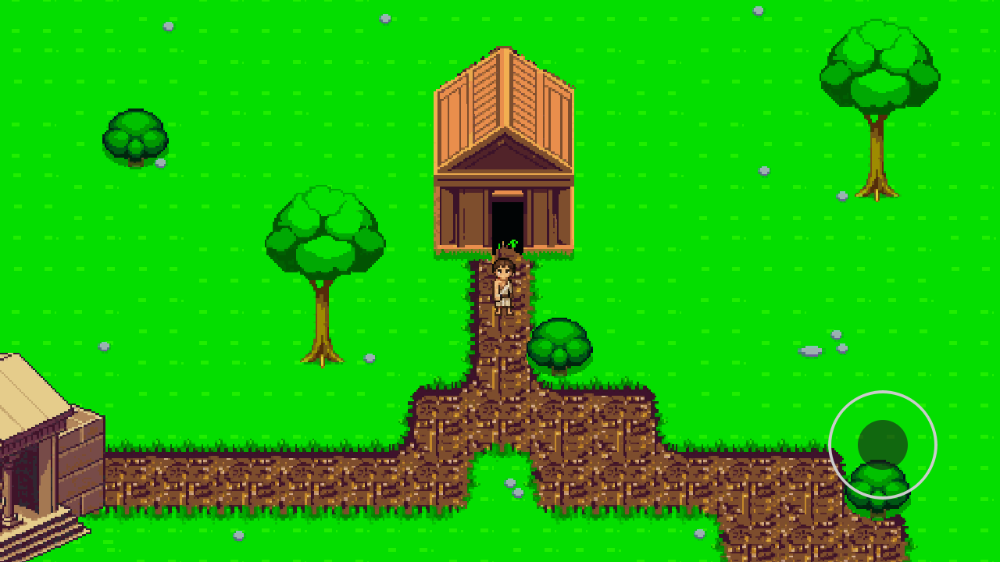
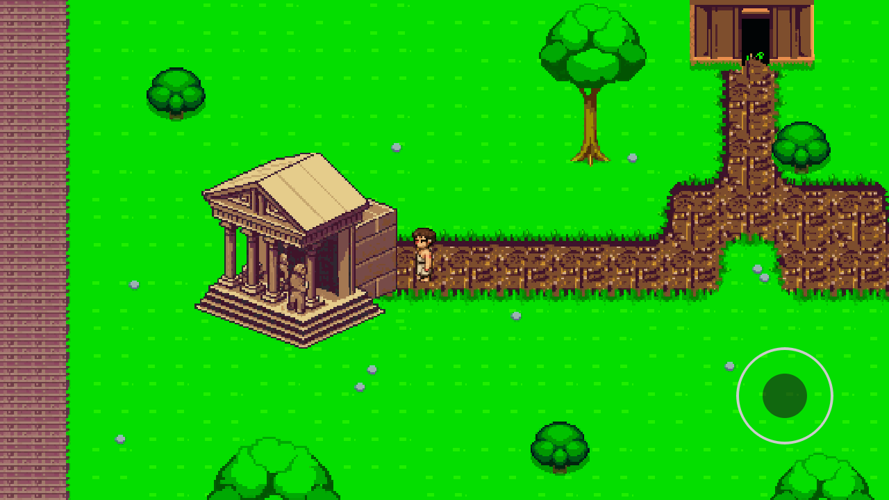
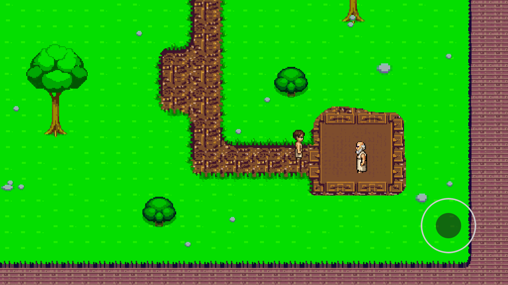

## Stoa DEMO - Guía rápida

### Controles

- **Moverse por el mapa**: Flechas de dirección - joystick virtual
- **Salir de una estancia**: ESC o botón superior izquierdo

### Estancias

- **Hogar**: Donde podrás escribir y consultar tus reflexiones en tu diario estoico
- **Gimnasio estoico**: Donde encontrarás misiones y juegos con los que subir de nivel en las distintas virtudes estoicas
- **Stoa**: Donde encontrarás a tu mentor y consejos de los grandes estoicos clásicos, cuando necesites un poco de guía

¡Empieza el día con alguna misión del gimnasio y no te olvides de cerrarlo con una entrada en el diario! Tu mentor estará siempre esperándote en la Stoa dispuesto a sostenerte con una perla de sabiduría. Así irás ganando experiencia en las distintas virtudes estoicas y subiendo de nivel.

